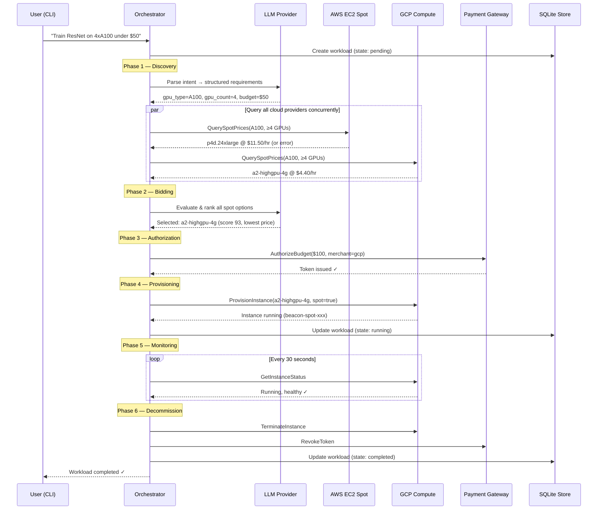
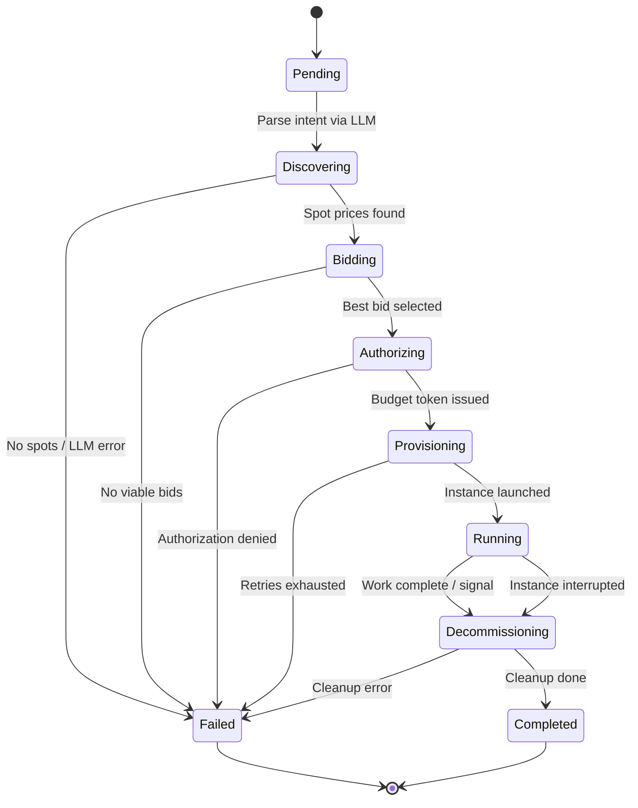
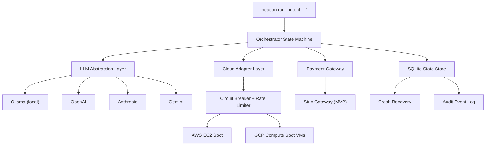

<p align="left">
  
</p>

# Beacon — Agentic Shopper For Cloud Compute

Beacon autonomously discovers, bids on, provisions, and decommissions cloud spot instances based on natural language workload intents. It uses LLMs to parse user intents and evaluate spot pricing options, driving a complete lifecycle state machine from discovery to teardown.

## Features

- **Model-Agnostic LLM Layer** — Ollama, OpenAI, Anthropic, and Gemini support behind a single `Provider` interface
- **Multi-Cloud Spot Integration** — Real spot pricing queries and instance provisioning via AWS EC2 and Google Cloud (GCP) Spot VMs
- **Autonomous Lifecycle** — Full state machine: Discovery → Bidding → Authorization → Provisioning → Monitoring → Decommission
- **Crash Recovery** — SQLite state persistence detects and cleans up orphaned compute on restart
- **Safety Guards** — Circuit breakers, rate limiters, retry limits, and budget enforcement prevent runaway costs
- **Structured Decision Logging** — zerolog JSON audit trail of every bidding evaluation and state transition

## Quick Start

```bash
# Build
go build -o beacon ./cmd/beacon/

# Run with Ollama (local LLM)
export BEACON_LLM_PROVIDER=ollama
export BEACON_LLM_MODEL=llama3
beacon run --intent "Train ResNet on 4xA100 under $50"

# Run with OpenAI across multi-cloud (AWS + GCP)
export BEACON_LLM_PROVIDER=openai
export BEACON_LLM_API_KEY=sk-...
export BEACON_LLM_MODEL=gpt-4o
export BEACON_GCP_PROJECT="your-gcp-project-id"
beacon run --intent "Run inference on T4 GPU in us-west-2" --budget 25

# Check active workloads
beacon status

# Recover orphaned workloads after a crash
beacon recover
```

## Configuration

All configuration is via environment variables:

| Variable | Default | Description |
|---|---|---|
| `BEACON_LLM_PROVIDER` | `ollama` | LLM provider: `ollama`, `openai`, `anthropic`, `gemini` |
| `BEACON_LLM_MODEL` | `llama3` | Model identifier |
| `BEACON_LLM_ENDPOINT` | `http://localhost:11434` | LLM API endpoint (required for Ollama) |
| `BEACON_LLM_API_KEY` | — | API key (required for hosted providers) |
| `BEACON_AWS_REGION` | `us-east-1` | Default AWS region |
| `BEACON_AWS_PROFILE` | — | AWS credentials profile |
| `BEACON_GCP_PROJECT` | — | GCP Project ID (Enables GCP adapter if set) |
| `BEACON_GCP_REGION` | `us-central1` | Default GCP region |
| `BEACON_GCP_ZONE` | `us-central1-a` | Default GCP zone |
| `BEACON_MAX_BUDGET` | `100.0` | Global maximum budget per workload (USD) |
| `BEACON_DB_PATH` | `beacon.db` | SQLite database path |
| `BEACON_LOG_LEVEL` | `info` | Log level: `debug`, `info`, `warn`, `error` |
| `BEACON_LOG_FORMAT` | `console` | Log format: `json`, `console` |
| `BEACON_MAX_PROVISION_RETRIES` | `3` | Max provisioning retry attempts |
| `BEACON_MAX_DISCOVERY_RETRIES` | `5` | Max discovery retry attempts |
| `BEACON_RATE_LIMIT` | `10.0` | Cloud API rate limit (requests/sec) |

## How It Works — Example Run

Running `beacon run --intent 'Train ResNet on 4xA100 under $50'` triggers the following autonomous flow:



## Workload State Machine



## Architecture



## Project Structure

```
beacon/
├── cmd/beacon/              # CLI entry point (cobra)
├── pkg/
│   ├── orchestrator/        # Core state machine, intent parsing, bidding
│   ├── llm/                 # Model-agnostic LLM abstraction (4 providers)
│   ├── cloud/               # Cloud adapter interface
│   │   ├── aws/             # AWS EC2 Spot adapter
│   │   └── gcp/             # GCP Compute Spot VM adapter
│   ├── payment/             # Payment gateway interface + stub
│   ├── state/               # SQLite state persistence + crash recovery
│   └── config/              # Environment-based configuration
├── internal/testing/        # Mock cloud server + test harnesses
└── docs/                    # ADRs and API specs
```

## License

TBD
